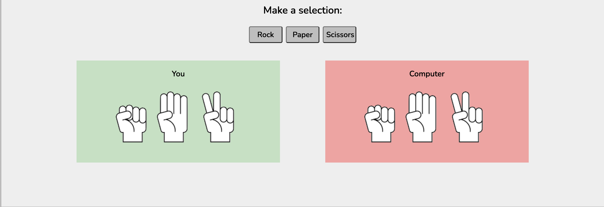
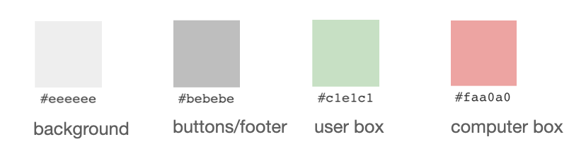
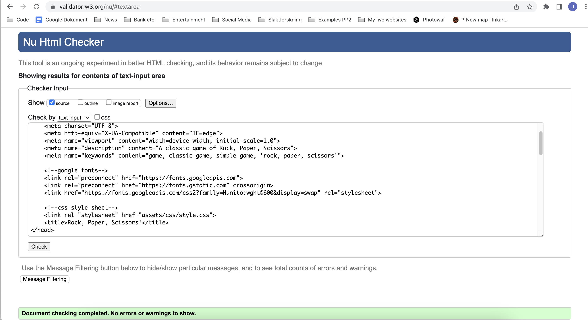
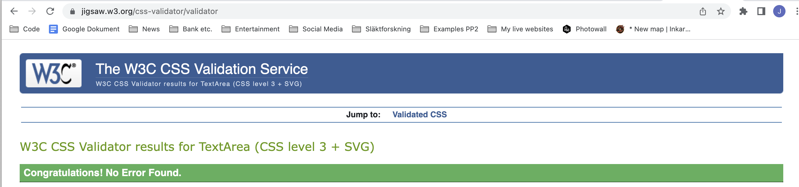
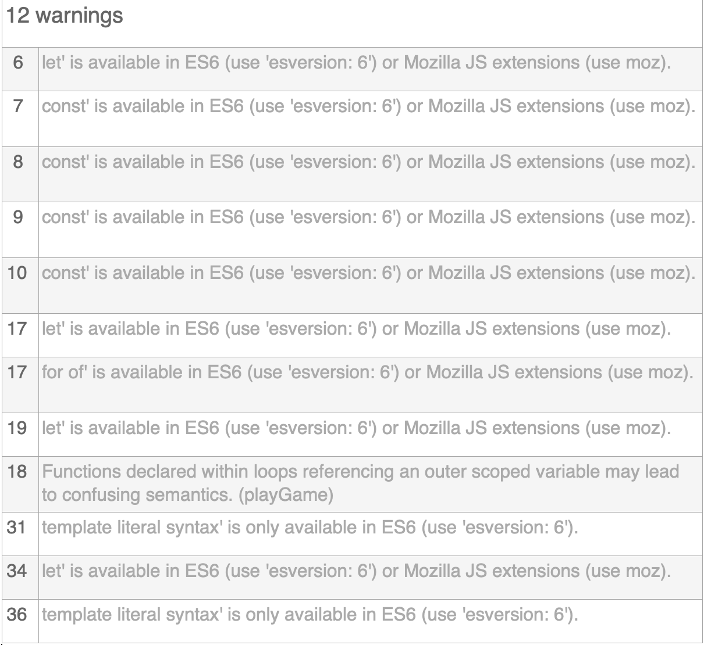
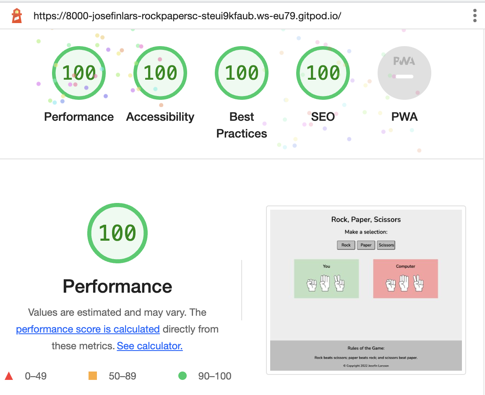
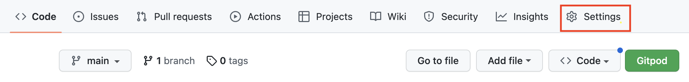
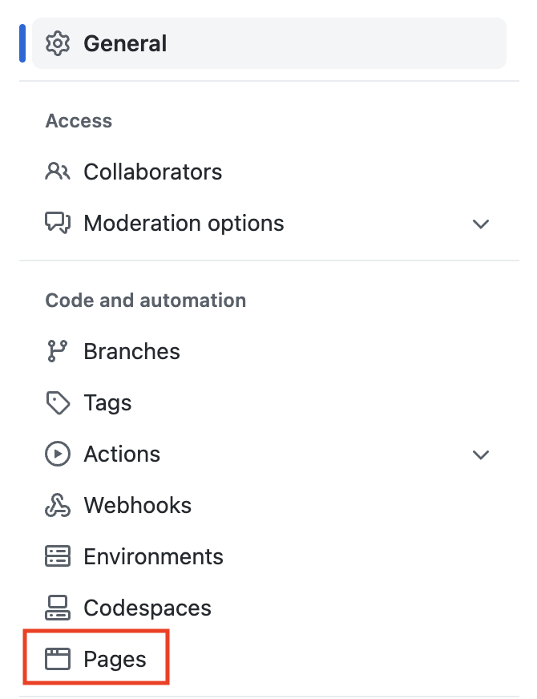
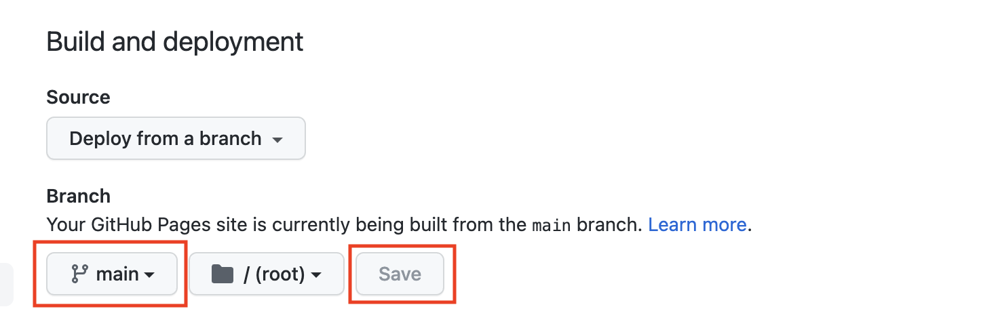
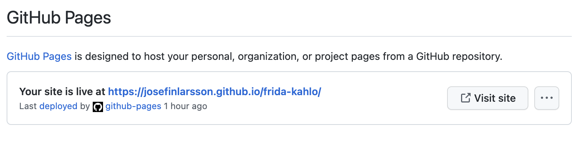

# Rock, Paper, Scissors Game

This website contains a simple classic game of Rock, Paper, Scissors which is well known and loved by many.
The websites intention is to provide a simple and userfriendly game of chance.
The website is targeted against a wide range of users from all ages to provide a couple of minutes of simple entertainment.

 

## Project Goal
<li>To show the developers ability to build a responsive website using HTML, CSS and JavaScript.</li>
 

## Target Audience
<li>People of all ages who are interested in playing the classic game for a couple of minutes of entertainment.</li>
 

# Features

## Existing Features

### Header
<li>A simple header with the name of the game is placed on top of the page.</li>

 

### Game section
<li>The main section holds the game including a simple instruction, three buttons to make a selection, a text alert section and finally the two boxes for user and computer showing their selected symbol.</li>

 

### The Footer
<li>The footer is kept basic and includes the rules of the game as well as developers copyright on the bottom.</li>

 

  

## Features Left to Implement
 

### Game functions
<li>A scoring system to keep track of number of wins.</li> 
 
<li>A username input to personalise the experience and save previous scores.</li>
 
<li>A leaderboard based on usernames previous scores.</li>
 
<li>Animations and movement of the symbols</li>
 

# Design

## Colour Scheme

<li>The colour scheme was kept very simple with basic grey tones as background, footer and buttons and the addition of two simple contrasting colours with light green for the user and light red for the computer to give the two boxes clear separation.
</li>

 

## Typography

<li>Font was chosen and imported from Google Fonts.
All text contains font: Nunito.
It was chosen for its simplicity and playfulness.
The decision to use only one font was based on the very limited amount of text content.
All font is displayed in a basic black colour.</li>
 

# Testing

<li>Manual testing of buttons to generate game play.</li>
<li>Manual testing to ensure text appears as result message.</li>
<li>Manual testing to ensure correct text result message appears.</li>

<li>Manual testing of code indentation and correct code formats.</li>
<li>Manual testing to verify class and id names are used accurately.</li>
 

## Responsive devices
Tested with Chrome Dev Tools and found to be responsive on the following devices:
<li>Iphone 12 Pro</li>
<li>Pixel 5</li>
<li>Samsung Galaxy S20 Ultra</li>
<li>Nest Hub Max</li>
<li>Ipad</li>
<li>Surface Pro 7</li>
 

Found to not be fully responsive on the following devices:
<li>Ipad Pro</li>
<li>Nest Hub</li>
 

General comment:
<li>Found to be responsive to dimensions down to 362 x 623</li>
 

## Validator testing
 

#### HTML
<li>No errors were found when passing through the official W3C validator.</li>

 

#### CSS
<li>One inital error was found on first testing. This was simply a mistake of adding ## twice before a hed colour code. The site still worked and this was not picked up until the CSS validation site. It was a simple mistake to correct and on the second attempt no errors were found when passing through the official (Jigsaw) validator.</li>

 

#### JavaScript
<li>19 errors were found on first testing however 7 of those were simple overuse of semi-colons and were quickly corrected. 12 errors remain as seen in below screenshot from the official (JSHint) validator. 
</li>
<li>Note row 18 error was tested in multiple ways and decided to keep code as is because all attempts at alterations created a bug in the gamePlay function. The game functions as planned regardless of this warning.</li>
<li>Note all other warning except row 18 are similar "available in ES6 (use 'esversion: 6') or Mozilla JS extensions (use moz)." Upon searching on forums for a solution to this error I only came across suggestions to change the settings on VS Code in order to prevent this error message. However instructions found on multiple forums to change JSHint settings on VS Code was not possible as it did not come up in settings search on Gitpod. Due to the fact that the game functions as planned I decided to ignore these warnings.</li>

 

#### LIGHT HOUSE
<li>Light House test performed with the below result.</li>

## Fixed Bugs
 <ul>
 <li>Repaired styling errors</li>
 <li>Repaired missing closing tags</li>
 <li>Improved website responsiveness to different screen resolutions.</li>
 </ul>

 ## Unfixed Bugs
<ul>
<li>Still requires further improvement for devices Ipad Pro and Nest Hub responsiveness.</li>
<li>still has some Javascript warnings as listed above but game functions as planned.</li>
</ul>

# Technology Used

## Languages
<li>HTML, CSS and JavaScript</li>
 

## Tools and libraries
<li>https://fonts.google.com/- to download all fonts used</li>
<li>https://developer.chrome.com/docs/devtools/- for quick testing and live preview adjustments and trouble shooting</li>
<li>https://gitpod.io - to create and host the website.</li>
<li>https://github.com- to deploy the website.</li>
<li>https://ui.dev/amiresponsive- to create the image displaying the homepage on multiple devices.</li>
 

# Deployment
The site was deployed to GitHub pages. The steps to deploy are as follows:
<ol>
<li>In the GitHub repository navigate to the Settings.
</li>

<li>From the left-hand menu select Pages.
</li>

<li>Under Build and deployment-Source-Branch. Select main branch and save.
</li>

<li>Wait a couple of minutes and then refresh the page.
At the top of the page your live link will be made available.
</li>
</ol>

 

The live link for this project can be found here - https://josefinlarsson.github.io/frida-kahlo/index.html

# Credits

<li>General code was created from the developers own knowledge gained during Code Institute lessons on learning platform with particular focus on the "Love-Maths" lesson project as well as the example video of Rock, Paper, Scissors Game.</li>

<li>Additionally research, understanding and inspiration was gained from Code Institute slack forums, Stackoverflow.com, W3schools.com as well as youtube videos by Developedbyed at https://youtu.be/qWPtKtYEsN4 and Code with Ania Kubów at https://www.youtube.com/watch?v=RwFeg0cEZvQ&t=2057s
</li>

 

## Content
<li>The text content is written by the web developer and not copied.
The game idea is an existing classic game played both online as well as offline.</li>

## Media
<li>The starter image is taken from openphysed.org and simply re-worked with Mac Preview software to remove background as well as cut and make image into three symbols used for gameplay.</li>

